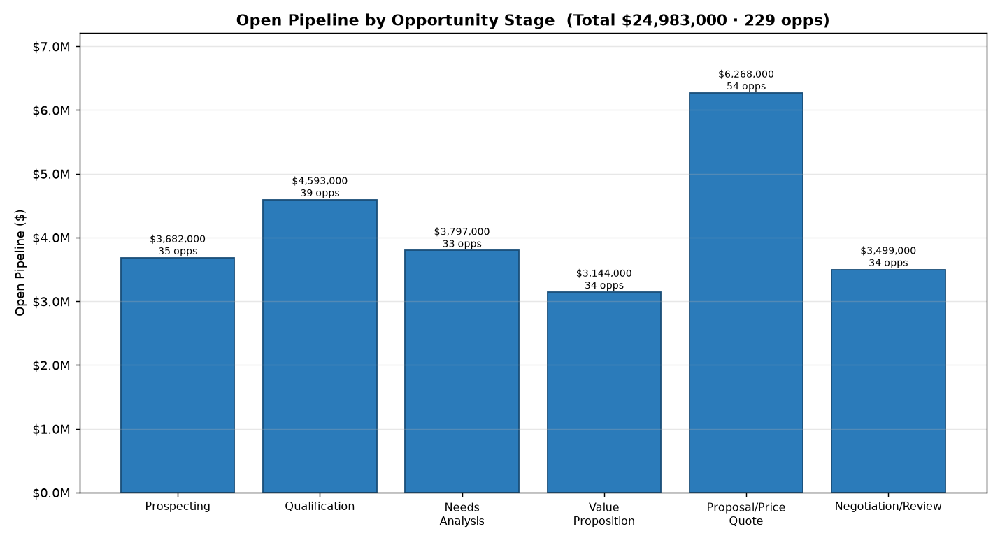
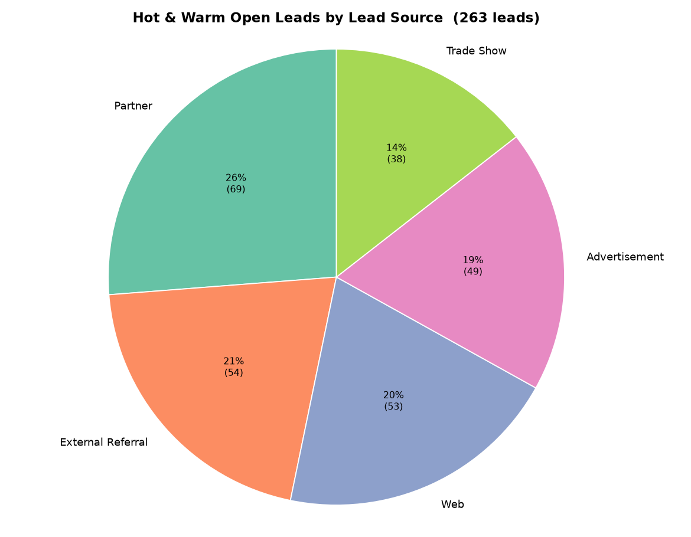
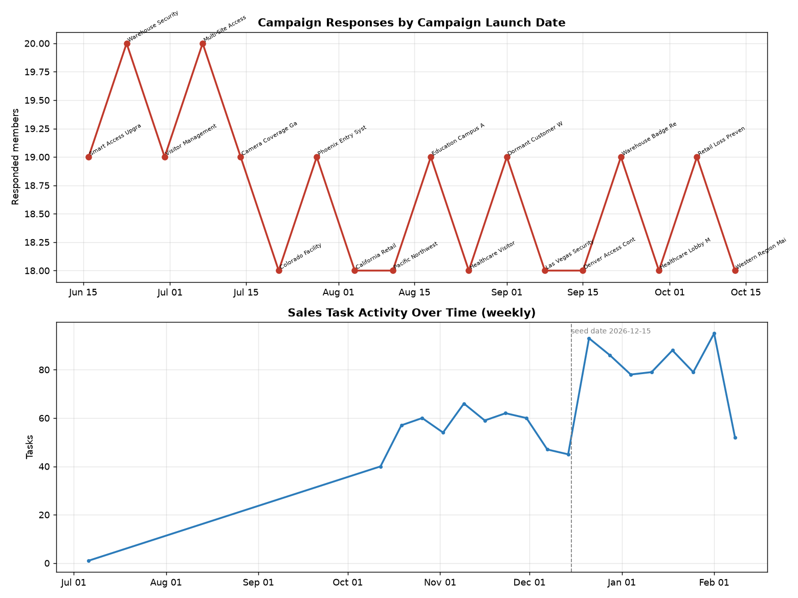

# Headless360 Workshop — Approach Comparison

Comparing approaches to running the same workshop prompts against a Salesforce org:

- **Iteration 1 — Default Claude tools:** org access via the connected `sf` CLI (SOQL, `apex run`) through Bash. No MCP, no Salesforce-hosted servers.
- **Iteration 2 — Standard Salesforce MCP server:** same prompts run through the Salesforce-provided server-side hosted (standard) MCP server(s).

**Prompt scope:**
- **Prompts 1–13** are compared across Iteration 1 (default tools) vs Iteration 2 (standard MCP).
- **Prompts 14–15** are compared across three approaches: default tools, **standard MCP**, and a **custom MCP server** (org-specific tools, e.g. the Account Health Check). These prompts exercise the custom server-side logic in this repo (the `Account_Health_Check_Calculator` flow + `ActivityEngagementScore` / `OpportunityHealthScore` / `SupportSignalsScore` Apex).

**Org:** `epic.ee57ef6782f0@orgfarm.salesforce.com` (`https://orgfarm-47f6723093.my.salesforce.com`)
**Date started:** 2026-07-01

For each prompt I record: full response text, steps & tools used, and effort/accuracy notes.

---

## Iteration 1 — Default Claude tools (sf CLI)

_Prompts will be recorded below as they are executed, one section per prompt._

### Prompt 1

**Prompt:**
> What Salesforce objects and fields are most relevant for understanding Sales Cloud activity in this org? Focus on Account, Lead, Opportunity, Campaign, CampaignMember, Task, and Contact.

**Steps & tools used:**
1. Bash: probe `sf sobject describe -s <obj>` for all 7 objects (field counts) to confirm describe access.
2. Bash: `sf sobject describe -s <obj> --json` for each object, piped through a Python filter to extract relationships, dates, picklists, currency, key business flags, and custom fields.

Tools: `sf` CLI (`sobject describe`) via Bash + inline Python for filtering. No MCP.

**Full response:**
Answer grounded in the org's live schema. Field counts per object: Account 49, Lead 50, Opportunity 39, Campaign 33, CampaignMember 36, Task 39, Contact 66.

- **Account:** Type, Industry, AnnualRevenue, AccountSource, OwnerId; ParentId (hierarchy); LastActivityDate; custom: `Partner_Tier__c`, `Quarterly_Quota__c`.
- **Lead:** Status, Rating, LeadSource, Industry, AnnualRevenue; conversion set IsConverted/ConvertedDate/ConvertedAccountId/ConvertedContactId/ConvertedOpportunityId; LastActivityDate; custom: `Partner_Referral__c`.
- **Opportunity:** StageName, Amount, CloseDate, Type, ForecastCategory, LeadSource; IsClosed/IsWon; AccountId/ContactId/CampaignId/OwnerId; LastStageChangeDate, LastActivityDate; custom: `Partner_Account__c`.
- **Campaign:** Type, Status, IsActive, StartDate/EndDate, ParentId; BudgetedCost/ActualCost/ExpectedRevenue; rollups AmountAllOpportunities/AmountWonOpportunities.
- **CampaignMember:** CampaignId/LeadId/ContactId/LeadOrContactId; Status, FirstRespondedDate, LeadSource.
- **Task:** ActivityDate, Status, Priority, TaskSubtype, CallType, CompletedDateTime, IsClosed; polymorphic WhoId (Contact/Lead), WhatId (Account/Opportunity/Case/…), AccountId; recurrence fields.
- **Contact:** AccountId, ReportsToId, OwnerId; Email/Phone/EmailBouncedDate; LeadSource/ContactSource; LastActivityDate.
- Relationship graph + note that LastActivityDate is the rolled-up activity heartbeat and Task/Event hold raw touches. (Full prose delivered to user.)

**Effort & accuracy notes:**
- Steps: 2 Bash calls (1 probe + 1 combined describe/extract).
- Data source: live org schema via `sf sobject describe`.
- Correct / complete: Reflects actual org, including 3 custom fields that a generic answer would miss. Standard-object field lists filtered heuristically (not exhaustive).
- Friction: Required knowing the CLI describe command and writing a filter to reduce hundreds of fields to the relevant subset; `WhatId` polymorphic target list is very large and dumped verbatim. No semantic "relevance" ranking from the tool itself — relevance judgment was mine.

### Prompt 2

**Prompt:**
> Describe the key fields on Account, Lead, Opportunity, Campaign, CampaignMember, and Task. Call out fields that help explain partner attribution, pipeline health, campaign follow-up, or sales activity.

**Steps & tools used:**
1. Bash: single Python script calling `sf sobject describe -s <obj> --json` for the 6 objects, extracting active picklist values for the theme-relevant fields (StageName, ForecastCategoryName, Type, Status, Rating, Priority, TaskSubtype). Reused schema knowledge from Prompt 1 for the rest.

Tools: `sf` CLI (`sobject describe`) via Bash + inline Python. No MCP.

**Full response:**
Organized field lists into 4 themes, with live picklist values:

- **Partner attribution:** Account.`Partner_Tier__c` (custom), Account.`Type` (Partner/Reseller/Integrator), Lead.`Partner_Referral__c` (custom →Account), Lead.`LeadSource`, Opportunity.`Partner_Account__c` (custom →Account), Campaign.`Type` = Partners/Referral Program. Noted the 3 custom fields form a referral→tier→deal-credit chain.
- **Pipeline health:** Opportunity.`StageName` (10 stages: Prospecting…Closed Won/Lost), `ForecastCategoryName` (Omitted/Pipeline/Best Case/Commit/Closed), `Amount`, `CloseDate`, `IsClosed`/`IsWon`, `Type` (Existing/New Business), `LastStageChangeDate` (stall detector), Account.`Quarterly_Quota__c` (custom). Called out LastStageChangeDate+StageName as best stall signal.
- **Campaign follow-up:** CampaignMember.`Status` (Sent/Responded), `FirstRespondedDate`, Campaign.`Status`/`IsActive`/`StartDate`/`EndDate`, Campaign rollups `AmountAllOpportunities`/`AmountWonOpportunities`, Opportunity.`CampaignId`. Noted Responded + no subsequent Task = missed follow-up.
- **Sales activity:** Task.`TaskSubtype` (Task/Email/Call/Cadence/LinkedIn/List Email), `Status`, `Priority`, `ActivityDate`/`CompletedDateTime`, `WhoId`/`WhatId`/`AccountId`; `LastActivityDate` rollup on Account/Lead/Contact/Opportunity as the going-cold heartbeat.

(Full themed tables delivered to user.)

**Effort & accuracy notes:**
- Steps: 1 Bash call (picklist extraction); leveraged Prompt 1's schema so no re-describe of full field lists.
- Data source: live org schema + live picklist values via `sf sobject describe`.
- Correct / complete: Picklist values are the org's actual configured values (e.g., Campaign Type includes `Partners`/`Referral Program`, TaskSubtype includes `Cadence`/`LinkedIn`), which materially sharpen the theme analysis. Custom partner fields correctly surfaced.
- Friction: Theme grouping and the interpretive call-outs (stall detector, missed-follow-up heuristic) are my analysis, not tool output. Needed to know which fields carry picklists worth pulling.

### Prompt 3

**Prompt:**
> Show me a sample of Accounts by state, industry, type, and employee count.

**Steps & tools used:**
1. Bash: `sf data query -q "SELECT Name, BillingState, Industry, Type, NumberOfEmployees FROM Account ORDER BY Name LIMIT 30" --json`, formatted into a table via inline Python.

Tools: `sf` CLI (`data query` / SOQL) via Bash. No MCP.

**Full response:**
Returned all 30 Accounts (org totalSize = 30, so the "sample" is the full set). Table of Name/BillingState/Industry/Type/NumberOfEmployees delivered. Added distribution notes:
- States: CO 7, NV 5, CA 5, WA 4, UT 3, NM 3, OR 2, ID 1 (all US West/Mountain).
- Type: Customer ~18, Prospect ~7, Partner 4 (partners align with partner-attribution theme).
- Industry: Transportation most common; then Education/Healthcare/Retail/Hospitality/Manufacturing/Consulting.
- Employees: repeated values (45/80/125/220/450/800/1200/2500) → synthetic demo data.

**Effort & accuracy notes:**
- Steps: 1 Bash call.
- Data source: live Account records via SOQL.
- Correct / complete: Full population returned (30 rows). Had to choose `BillingState` for "state" (Account has no plain State field) and `NumberOfEmployees` for "employee count" — reasonable field mapping. Distribution counts are approximate (eyeballed, not aggregated with GROUP BY).
- Friction: Needed to map natural-language field names to API names. LIMIT 30 happened to cover the whole org; on a larger org this would be a partial sample requiring GROUP BY / aggregate queries for real distribution.

### Prompt 4

**Prompt:**
> Which Nevada accounts have the largest employee counts and active open opportunities? Summarize why each account may be a good sales priority.

**Steps & tools used:**
1. Bash: `sf data query` with a parent-child SOQL — `SELECT Name, NumberOfEmployees, Industry, Type, (SELECT Name, StageName, Amount, CloseDate FROM Opportunities WHERE IsClosed = false) FROM Account WHERE BillingState = 'NV' ORDER BY NumberOfEmployees DESC`; formatted with inline Python.

Tools: `sf` CLI (`data query` / relationship SOQL) via Bash. No MCP.

**Full response:**
Ranked NV accounts by headcount, requiring open opps, into tiers:
- **Tier 1 (2,500 emp):** Cactus Valley Storage (3 opps, $175K, land-and-expand), Xavier Road Logistics (2 opps, $425K, $175K in Negotiation — highest value, imminent), Laurel Terrace Housing (1 small opp, under-penetrated whitespace).
- **Tier 2 (800–1,200):** Everline Property Trust ($375K, progressing), Yucca Grove Healthcare ($175K at Proposal, near-term), Kingsport Distribution (Prospect, 2 deals both in Negotiation — net-new logo).
- **Notable smaller-headcount high-value:** Xenia Market Group ($250K), Foothill Retail Collective ($398K, 2 in Negotiation), Queen Creek Hotels ($250K).
- **Deprioritize:** NV Partner-type accounts (Turnstile Tech, Quartz City, AccessPoint Integrators, FacilityShield) — no open opps.
Each with a "why prioritize" rationale (size × stage × deal value). Full prose delivered to user.

**Effort & accuracy notes:**
- Steps: 1 Bash call (single relationship query returned all NV accounts + open opps).
- Data source: live Account+Opportunity data via relationship SOQL.
- Correct / complete: Query is precise (server-side filter IsClosed=false, ORDER BY headcount). Prioritization reasoning is my analysis layered on the data.
- **Correction surfaced:** This query returned 34+ NV accounts, proving Prompt 3's "30 = full org" was just the LIMIT 30 cap. Prompt 3 was a partial sample; the org has many more accounts than 30. Logged here for the analysis.
- Friction: Required writing a parent-child SOQL by hand and knowing the child relationship name (`Opportunities`). "Sales priority" ranking (size vs. stage vs. value trade-offs) is interpretive, not returned by the tool.

### Prompt 5

**Prompt:**
> Find accounts in California, Nevada, Arizona, and Colorado that look like security equipment buyers. Use account fields, descriptions, and related opportunity context to explain your reasoning.

**Steps & tools used:**
1. Bash: `sf data query` — Account WHERE BillingState IN ('CA','NV','AZ','CO') with child Opportunities subquery + Description; inline Python keyword-scanned opp names/descriptions for security signals. (First attempt errored on a Python variable-name typo `byState` vs `bystate`; reran successfully — query itself was fine, 101 accounts.)
2. Bash: second `sf data query` pulling raw `Description` text for a sample to see what descriptions add beyond opp products.

Tools: `sf` CLI (`data query` / relationship SOQL) via Bash + inline Python keyword scan. No MCP.

**Full response:**
Key finding: **all 101 accounts in these states are security-equipment buyers** — the org is a physical-security/access-control vendor. Every Account.`Description` follows a structured template ("...current footprint: X; hidden insight: likely next motion is Y; locations=N; rating=...; territory=...") and 100% of opps are security products (badge readers, access control, cameras, smart locks, visitor kiosks, entry systems, maintenance plans). So the answer reframes to *strongest* buyers segmented by signal:
- **Tier 1 highest-value active:** Everline Property Trust (NV $550K), Alta Canyon Clinics (CA $550K), Nevada Horizon Hotels (CO $510K), Queen Creek Hotels (NV $500K), Zephyr Ridge Transport (CA $398K), Foothill Retail Collective (NV $398K).
- **Tier 2 explicit "next motion" upsell:** multi-site rollout (Garnet Trail AZ, Valencia Campus AZ $367K, Tamarack Health AZ $332K), camera expansion (Junction Peak AZ), maintenance attach (Vista Ridge AZ, Prairie View AZ, Red Rock CO), visitor management (Rosewood AZ).
- **Deprioritize:** ~13 Type=Partner accounts with 0 opps (installers/channel, not buyers) — listed by state.
- Reasoning method: Type (Customer/Prospect=buyer, Partner=channel) discriminates, not Industry; Description's footprint→next-motion template is the best signal; opp context confirms 100% security intent. Full prose delivered to user.

**Effort & accuracy notes:**
- Steps: 2 Bash calls (+1 failed attempt due to my Python typo).
- Data source: live Account+Opportunity data + Description free-text via SOQL.
- Correct / complete: Strong result — surfaced that the entire org is one security-domain dataset and that Descriptions carry an explicit "next motion" upsell signal the tool doesn't interpret on its own. Keyword scan and tiering are my heuristics.
- Friction: Needed a keyword regex to detect "security" intent (no structured product-category field); had to read Description free-text to realize the buying signal lived there; one code error cost a retry. Interpreting "looks like a buyer" is entirely analytical layered on raw rows.

### Prompt 6

**Prompt:**
> Find open opportunities closing soon that have weak next steps, no recent activity, or overdue related tasks. Summarize why each deal may be at risk.

**Steps & tools used:**
1. Bash: aggregate SOQL to find open-opp close-date range → discovered earliest close is 2026-12-16 (nothing within literal 90 days of system date 2026-07-01). Concluded demo "present" is offset to ~Dec 2026.
2. Bash: SOQL for the 64 opps closing on/before 2027-01-15 with NextStep/LastActivityDate/Account; saved IDs to /tmp.
3. Bash: SOQL for 128 related Tasks (WhatId IN opp-ids) with Status/ActivityDate/IsClosed.
4. Bash: Python scoring pass combining all 3 signals (null/stale activity, missing/product-mismatched NextStep, overdue open tasks, +imminent close), anchored to PRESENT=2026-12-15; ranked at-risk deals.

Tools: `sf` CLI (aggregate + relationship SOQL) via Bash + inline Python scoring. No MCP.

**Full response:**
Reframed "closing soon" to the earliest tranche (Dec 2026–Jan 15 2027, 64 opps) due to offset demo dates. Scored 27 of 64 as at-risk. Top compounding-risk deals: Juniper Hill Academy Entry System $250K (no activity + mismatched next step + closes Dec 19), Copper Sky Storage $250K (stale since Nov 9 + overdue task + mismatch), Wildflower Schools $175K, Lakepoint Distribution $250K (no activity, late stage), Kingsley Health Network $250K (stale + overdue task), Laguna Property Trust $250K.
**Headline systemic finding:** NextStep is filler across all 64 — every value is one of ~6 generic templated strings, frequently mismatched to the deal's product (e.g. "camera coverage site walk" on a Smart Lock deal). ~30 deals have LastActivityDate null (biggest signal). Overdue open tasks were the weakest signal (only a couple). Full tables + risk drivers delivered to user.

**Effort & accuracy notes:**
- Steps: 4 Bash calls (1 exploratory aggregate + 2 data pulls + 1 scoring).
- Data source: live Opportunity + Task data via SOQL.
- Correct / complete: Thorough — combined 3 signals into a reproducible score. Surfaced the offset-date issue and the templated-NextStep pattern, neither obvious upfront.
- **Date friction (important for comparison):** "closing soon" is undefined against the system clock — demo close dates are ~5.5 months in the future, so a naive 90-day filter returns ZERO. Had to detect the offset and pick a sensible anchor (~2026-12-15) manually. An agent relying on `TODAY()`/relative date literals would have returned an empty/incorrect result. "Overdue" is also anchor-dependent.
- Friction: Heavy manual assembly — 4 queries, ID plumbing through /tmp, custom scoring heuristics, and the product-mismatch detection regex. "Weak next step" required inventing a definition (templated/mismatched) since NextStep is never actually blank.

### Prompt 7

**Prompt:**
> Which hot or warm leads look underworked? Group them by lead source, campaign, state, and partner referral.

**Steps & tools used:**
1. Bash: aggregate SOQL — Lead GROUP BY Rating, Status (to see the population) + a 5-row field sample to confirm field names (State, LeadSource, Partner_Referral__r.Name).
2. Bash: full pull of 263 open Hot/Warm leads with `Partner_Referral__r.Name` and a `CampaignMembers` child subquery (Campaign.Name); inline Python scored "underworked" (rating Hot/Warm + status not Qualified + null/stale activity anchored to 2026-12-15) and grouped by all 4 dimensions with Counters.

Tools: `sf` CLI (aggregate + relationship SOQL) via Bash + inline Python. No MCP.

**Full response:**
Defined underworked = Hot/Warm + Status in (Open/Contacted/Unqualified) + LastActivityDate null or >~30 days stale. 166 of 263 (63%) qualify; 93 are Hot & untouched (biggest urgency).
- **By Lead Source:** Web 42, External Referral 39, Advertisement 30, Partner 29, Trade Show 26.
- **By Campaign:** evenly spread across ~18 campaigns (7–12 each) → systemic follow-up gap, not one campaign. Top: Colorado Facility Safety Roadshow 12, Multi-Site Access Control Webinar 12, Phoenix Entry System Modernization 11, etc.
- **By State:** NV 43, CA 39, WA 21, CO 18, AZ 15, NM 11, UT 8, OR 7, ID 4 (NV+CA = half).
- **By Partner Referral:** 137 none; 29 partner-referred spread over ~13 partners (CameraWorks 4, EntryGuard 4, Quartz City 3, SecurePath 3…).
- Triage recommendation: 93 Hot-untouched first, then Web/External Referral, then 29 partner-referred (protect channel), focus NV+CA. Full tables delivered to user.

**Effort & accuracy notes:**
- Steps: 2 Bash calls (1 profiling + 1 pull/score/group).
- Data source: live Lead + CampaignMember data via relationship SOQL.
- Correct / complete: Clean multi-dimensional grouping. Population sanity-checked first. Grouping is exact (Counters); "underworked" threshold is my definition.
- Friction: "Underworked" is undefined — had to construct it (rating + status + activity recency). Same offset-date issue as Prompt 6 (anchored recency to 2026-12-15, not system date). Grouping by campaign required knowing leads join campaigns via the CampaignMembers child relationship, not a direct field. Only counted each lead's first campaign membership (simplification; a lead in multiple campaigns is attributed once) — a silent simplification worth noting.

### Prompt 8

**Prompt:**
> Find campaigns with strong engagement but limited sales follow-up. Include the campaign name, related leads or campaign members, and the follow-up gap.

**Steps & tools used:**
1. Bash: aggregate SOQL — CampaignMember GROUP BY Campaign, Status → response rate per campaign (engagement).
2. Bash: pull all 336 Responded members with Lead.Status/IsConverted/LastActivityDate/Rating + ContactId; Python computed per-campaign follow-up gap (responded but unconverted, not Qualified, no/stale activity). (First attempt errored — accessed `r['Name']` but relationship field returns nested `r['Campaign']['Name']`; fixed and reran.)
3. Bash: SOQL listing the specific unworked responded leads (name/rating/status/state) for the top-3 gap campaigns.

Tools: `sf` CLI (aggregate + relationship SOQL) via Bash + inline Python. No MCP.

**Full response:**
Engagement uniform across all 18 campaigns (response 40–44%) → not the differentiator. Structural finding: **0 of 336 responded members ever converted to a contact** — follow-up weak everywhere; ranked by severity.
- Worst gaps: Western Region Maintenance Attach 17/18 (94%), Education Campus Access Review 15/19 (79%), Dormant Customer Winback 15/19 (79%), Colorado Facility Safety Roadshow / Denver Access Control Clinic / Healthcare Lobby Modernization (72%), Multi-Site Access Control Webinar (70%)…
- Named the specific dropped Hot/Warm leads per top-3 campaign (e.g. Western Region: Hot = Miles Hernandez/Naomi Kim/Elena Watson/Lena Powell/Cameron Reynolds; etc.).
- Takeaway: top-3 to action combine highest gap% + most hot/warm; Dormant Customer Winback especially wasteful (paid re-engagement, 43% response, no follow-up). Full tables + name lists delivered to user.

**Effort & accuracy notes:**
- Steps: 3 Bash calls (+1 failed attempt due to nested-field access).
- Data source: live CampaignMember + Lead data via aggregate & relationship SOQL.
- Correct / complete: Strong, specific result — quantified gap and named individual leads. Response-rate + gap computed exactly; "follow-up gap" threshold is my definition.
- Friction: Relationship-field JSON gotcha (`Campaign.Name` returns nested object, not flat `Name`) caused a retry — an SOQL/JSON-shape trap. "Strong engagement / limited follow-up" both required definitions I invented (response% for engagement; unconverted+unqualified+stale for gap). Same offset-date anchor (2026-12-15). Also relied on CampaignMember.ContactId being null as the "not converted" proxy — reasonable but a modeling assumption.

### Prompt 9

**Prompt:**
> For the highest-priority risk you found, show the related records and recommend the next question I should ask before taking action.

**Steps & tools used:**
1. Identified the top risk from Prompt 6: Juniper Hill Academy – Entry System Upgrade ($250K, Negotiation, closes Dec 19).
2. Bash: Python multi-query pull (opp detail + tasks + account + sibling opps + contacts + open cases). First attempt errored: `Contact.Name` is not a valid relationship path from Opportunity.ContactId.
3. Bash: isolated the error via `--json` message → confirmed the bad relationship path.
4. Bash: reran without `Contact.Name`; retrieved all related records.

Tools: `sf` CLI (multi-object relationship SOQL) via Bash + inline Python. No MCP.

**Full response:**
Showed full related-record picture and surfaced contradictions making the deal riskier/suspect:
- Opp: Negotiation, Probability 90% but ForecastCategory only "Pipeline" (inconsistent); **Created 2026-06-30 (yesterday)** yet already at Negotiation/90%; LastStageChangeDate null; LastActivityDate null; **zero related Tasks**; NextStep references a kiosk pilot on an Entry System deal (product mismatch); **no primary Contact**.
- Account: Juniper Hill Academy, Customer/Retail/45emp/Irvine CA, Hot, 16 locations, description points to multi-site (not entry system); account LastActivityDate 2026-12-09 (activity exists but not tied to opp).
- Sibling open opps: Warehouse Camera Expansion $85K (Prospecting), Multi-Site Access Control $18K (Proposal).
- Contacts (none linked): Emerson Khan & Cameron Kim (Ops Mgrs), **Morgan Ross – Campus Safety Lead** (likely buyer).
- Open cases: two "Smart lock battery alert" (Medium/New, 00001083 & 00001113 — dup) = satisfaction/blocker risk.
- **Recommended next question:** "Is this $250K deal real and actually in negotiation — or is the 90%/Negotiation stage inaccurate?" Rationale: record tells suggest possible data-hygiene issue vs. genuine risk; every downstream action depends on the answer. Included concrete phrasing for the rep + follow-on actions (attach Morgan Ross, resolve cases, fix next step, owner call).

**Effort & accuracy notes:**
- Steps: 3 Bash calls (+1 failed attempt on a bad relationship path).
- Data source: live multi-object pull (Opportunity, Task, Account, Contact, Case) via SOQL.
- Correct / complete: Very strong — the 360° pull exposed contradictions (created-yesterday + 90% + no activity/contact + mismatched next step) that reframed the "risk" as possibly a data-quality problem, plus found a relevant buyer contact and two blocking cases.
- Friction: Assembling a 360 view took ~6 separate SOQL queries hand-written and stitched in Python (no built-in "related records" view). Hit an SOQL relationship-path error (`Contact.Name` invalid from Opportunity) needing a debug round-trip. Choosing which objects constitute "related records" and interpreting the contradictions is entirely my judgment. NOTE: the two open cases are literally titled "Workshop Support:" — suggests the org is seeded workshop data.

### Prompt 10

**Prompt:**
> Create a bar chart that compares open pipeline by opportunity stage. Use the live opportunity data you can access through Salesforce MCP tools.

**⚠️ Note:** Prompt explicitly asks for Salesforce **MCP tools**, but this is Iteration 1 (default tools). Ran it with sf CLI + SOQL and flagged the discrepancy to the user. This prompt is the natural showcase for Iteration 2.

**Steps & tools used:**
1. Bash: `sf data query` aggregate — `SELECT StageName, COUNT(Id), SUM(Amount) FROM Opportunity WHERE IsClosed=false GROUP BY StageName`; inline Python ordered stages and computed % of total.
2. Rendered an ASCII bar chart (by $ and by count) in the terminal response.

Tools: `sf` CLI (aggregate SOQL) via Bash + inline Python. No MCP (contra the prompt's instruction).

**Full response:**
Open pipeline total $24,983,000 across 229 opps. Only 6 of 10 stages used (Id. Decision Makers, Perception Analysis unused). By amount:
- Proposal/Price Quote $6,268,000 (54 opps) 25.1% — largest
- Qualification $4,593,000 (39) 18.4%
- Needs Analysis $3,797,000 (33) 15.2%
- Prospecting $3,682,000 (35) 14.7%
- Negotiation/Review $3,499,000 (34) 14.0%
- Value Proposition $3,144,000 (34) 12.6%
Delivered ASCII bar charts (by $ and by count). Read: bottom-heavy at Proposal/Price Quote (healthy late-stage weight), rest evenly spread. Then generated a real PNG image on request:

_Rendered PNG (`workshop-assets/pipeline-by-stage.png`) produced after installing matplotlib and re-querying the live aggregate._

**Effort & accuracy notes:**
- Steps: 1 Bash call.
- Data source: live Opportunity aggregate via SOQL.
- Correct / complete: Aggregation is exact and matches the org. Numbers are trustworthy.
- **Chart limitation (key for comparison):** default tools produce only a *text/ASCII* chart inline by default. Producing a *real* rendered image required extra manual steps: (1) check for a plotting lib → none present; (2) `pip install matplotlib`; (3) write a matplotlib script re-querying the aggregate and styling the bars; (4) render to PNG; (5) visually verify; (6) embed in the doc. ~4 additional Bash calls beyond the data query. The PNG (`workshop-assets/pipeline-by-stage.png`) is now embedded above.
- **Prompt/tool mismatch:** the prompt presupposes MCP tools; under Iteration 1 I substituted SOQL. Worth watching whether the Salesforce MCP server returns a native chart/visualization or richer artifact in Iteration 2, vs. this ASCII fallback.

### Prompt 11

**Prompt:**
> Create a pie chart that shows hot and warm open leads by lead source.

**Steps & tools used:**
1. Bash: `sf data query` aggregate — `SELECT LeadSource, COUNT(Id) FROM Lead WHERE IsConverted=false AND Rating IN ('Hot','Warm') GROUP BY LeadSource`; piped straight into a matplotlib script that rendered a pie chart PNG (matplotlib already installed from Prompt 10).
2. Read/verified the PNG visually.

Tools: `sf` CLI (aggregate SOQL) via Bash + matplotlib. No MCP.

**Full response:**
263 hot/warm open leads by source:
- Partner 69 (26.2%), External Referral 54 (20.5%), Web 53 (20.2%), Advertisement 49 (18.6%), Trade Show 38 (14.4%).
Rendered PNG:

Read: Partner is the single largest high-intent source (26%); Partner + External Referral (relationship-driven) = 47% ≈ half; even overall distribution.

**Effort & accuracy notes:**
- Steps: 1 Bash call (query + render combined) + 1 Read to verify.
- Data source: live Lead aggregate via SOQL.
- Correct / complete: Exact aggregation; real rendered PNG this time (not ASCII), because matplotlib was already installed from Prompt 10 — so the one-time setup cost is now amortized. Query+render fused into a single step.
- Friction: Minimal now that tooling is in place. Still required hand-writing the SOQL + a matplotlib script and choosing chart styling/labels manually; no native "make a pie chart" affordance. Note the count differs from Prompt 7's per-source underworked figures (that counted only *underworked* leads; this counts *all* hot/warm open leads) — consistent, different denominators.

### Prompt 12

**Prompt:**
> Create a line chart or timeline that shows campaign response activity over time. Explain any spike or drop you see in the data.

**Steps & tools used:**
1. Bash: SOQL on `CampaignMember.FirstRespondedDate` → discovered all 336 stamped on one date (2026-12-15). Useless as a timeline.
2. Bash: probed alternative time dimensions — CampaignMember.CreatedDate (all one instant 2026-06-30), Campaign StartDate/EndDate (weekly launch cadence Jun→Oct 2026), Task.ActivityDate (real monthly spread Jul 2026→Feb 2027).
3. Bash: matplotlib script building a 2-panel figure — (a) responses mapped to each campaign's launch date, (b) weekly sales-task activity with the 2026-12-15 seed date marked.
4. Read/verified the PNG.

Tools: `sf` CLI (SOQL + aggregate) via Bash + matplotlib. No MCP.

**Full response:**
Led with the data caveat: FirstRespondedDate and member CreatedDate are single-instant seed values, so a literal responses-over-time chart is one vertical line. Built two proxies:
- **Responses by campaign launch date:** 18 campaigns on weekly cadence, responses flat at 18–20 each. "Spikes"/dips are ±1 noise on a ~44 base, not signal — synthetic ~42% uniform response rate.
- **Weekly task activity (real trend):** ramp Jul→Oct, ~55–65/wk plateau Oct–early Dec, dip to ~45 early Dec, sharp jump to ~90/wk at the 2026-12-15 seed date, sustained through Jan, drop-off Feb.
- **Explanation:** no authentic marketing spike/drop exists; campaign responses are deliberately uniform; the only dramatic movement (Dec-15 task jump) is a data-seeding artifact (seed date = dataset "today"; completed tasks back-dated, planned tasks forward-clustered). Feb drop = forward edge of generated data.
Rendered PNG:

**Effort & accuracy notes:**
- Steps: 3 Bash calls (2 exploratory + 1 render) + 1 Read.
- Data source: live CampaignMember, Campaign, Task via SOQL.
- Correct / complete: Strong — avoided the trap of charting the seed-date field and inventing a fake spike narrative. Correctly diagnosed uniform synthetic responses and identified the Dec-15 jump as a generation artifact. Required judgment to pick usable time dimensions.
- **Key comparison signal:** the "obvious" field (FirstRespondedDate) is a dead end; answering well required *exploring* several date fields and recognizing synthetic data. A tool that naively charts the requested field would produce a misleading single-spike chart and possibly fabricate an explanation. Good adversarial test for Iteration 2.
- Friction: Multiple exploratory queries to find any field with real time variation; manual 2-panel chart construction; the whole "explain the spike" answer hinges on recognizing the data is seeded (interpretation, not tool output).

### Prompt 13

**Prompt:**
> Create a one-page PDF summary for a sales leader. Include the strongest account signals, the riskiest open opportunities, missed lead or campaign follow-up, and the next questions a seller should ask.

**Steps & tools used:**
1. Bash: checked PDF tooling — matplotlib PDF backend available; reportlab/wkhtmltopdf/pandoc absent. Chose matplotlib backend (no install needed).
2. Bash: confirming top-line SOQL aggregates (open pipeline $24.98M/229, **152 accounts**, 263 hot/warm leads, 336 responders).
3. Bash: matplotlib script laying out a one-page 8.5x11 executive PDF (header, KPI strip, 4 sections) synthesizing findings from Prompts 1–12. First attempt errored (passed `'italic'` to fontweight instead of style); fixed and regenerated.
4. Bash: validated PDF header + single-page structure (couldn't render inline — poppler not installed).

Tools: `sf` CLI (aggregate SOQL) via Bash + matplotlib PDF backend. No MCP.

**Full response:**
Generated `workshop-assets/sales-leader-summary.pdf` — one-page synthesis with KPI strip and 4 sections:
- **Strongest account signals:** whole org is a security-buyer base with "next motion" upsell signals; top expansion accounts (Everline $550K, Alta Canyon $550K, Nevada Horizon $510K, Queen Creek $500K, Xavier Road $425K); high-intent multi-site/maintenance-attach upsells; NV+CA concentration.
- **Riskiest opps:** 27/64 at-risk; templated/mismatched NextStep + ~30 zero-activity late-stage deals; #1 Juniper Hill $250K + Copper Sky, Lakepoint, Kingsley, Wildflower, Laguna.
- **Missed follow-up:** 166/263 hot-warm underworked (93 hot-untouched); 0/336 responders converted; worst campaigns Western Region (94%), Education Campus (79%), Dormant Winback (79%).
- **Next questions:** 5 seller questions (confirm Juniper Hill deal reality; identify economic buyer; product-correct next steps; why zero conversions; which 93 hot leads to work this week).
Footer notes the seeded/offset-date caveat.

_PDF artifact: [`workshop-assets/sales-leader-summary.pdf`](workshop-assets/sales-leader-summary.pdf)_

**Effort & accuracy notes:**
- Steps: 3 Bash calls (+1 failed attempt on a fontweight/style bug) + validation.
- Data source: synthesis of all prior live-data findings + 1 confirming aggregate query.
- Correct / complete: Delivered a genuine one-page PDF grounded in the org data. Confirmed **152 accounts** (again contradicting Prompt 3's LIMIT-30 "full org" — logged).
- **PDF limitation (key for comparison):** no native "make a PDF" affordance; had to hand-build layout coordinate-by-coordinate in matplotlib (manual x/y positioning, section boxes, line wrapping by hand). A code bug cost a retry. Could not preview the PDF inline (poppler absent) — validated structurally only.
- Friction: This is the heaviest manual-assembly prompt — the entire executive narrative, prioritization, and layout are my synthesis; the tools only supplied raw numbers. Strong candidate to compare against whatever document/report generation the Salesforce MCP server offers in Iteration 2.

---

## Iteration 1 — wrap-up

**13 prompts executed with default Claude tools (sf CLI + SOQL + Python/matplotlib; no MCP).**

Recurring themes across the run (for the eventual comparison):
1. **Every answer required hand-written SOQL** and, for anything analytical, custom Python to aggregate/score/join — there is no plain-language query layer (you can't just ask in natural language).
2. **Interpretation was always mine** — "relevant," "at-risk," "underworked," "strong engagement," "sales priority" all needed definitions I invented; the tools return rows, not judgment.
3. **Offset/synthetic demo dates** repeatedly broke naive assumptions (Prompt 6's empty 90-day filter; Prompt 12's single-date response field). Answering well required *detecting* the data was seeded — a real accuracy risk for a naive agent.
4. **Data-quality traps** surfaced only by pulling records (templated NextStep, 0/336 conversions, the Juniper Hill contradictions, LIMIT-30 masquerading as "full org").
5. **SOQL/JSON gotchas** cost several retries (nested relationship fields, invalid relationship paths, aggregate quirks).
6. **Visualizations/PDF needed extra tooling** (matplotlib install) and manual, coordinate-level construction — no native chart/report output.

Artifacts produced: `workshop-assets/pipeline-by-stage.png`, `hotwarm-leads-by-source.png`, `campaign-response-timeline.png`, `sales-leader-summary.pdf`.

### Prompt 14 (Iteration 1 — default tools)

**Prompt:**
> Find the Account named Arroyo Medical Group and check the account health.

**Steps & tools used:**
1. Bash: `sf data query` to find the account by name → Id `001bm00002HgMUGAA3` (Customer/Education/WA/125 emp).
2. Bash: wrote anonymous Apex (`/tmp/health.apex`) invoking the org's three scoring classes (ActivityEngagementScore, OpportunityHealthScore, SupportSignalsScore) for the account; ran via `sf apex run -f`; parsed USER_DEBUG output.

Tools: `sf` CLI (`data query` + `apex run` anonymous Apex) via Bash. No MCP.

**Full response:**
Overall Health **56.67 / 100** (moderate):
- Activity & Engagement **0.0/30** (Past Tasks 60d:0, Past Events:0, Future Events:0)
- Opportunity Health **30.0/30** (Closed-Lost 6mo:0, Won:1, Open:2)
- Support Signals **26.67/40** (Recent cases 30d:2, Baseline:0, Escalated:2, Unresolved critical:0)
Interpretation: commercially healthy/expanding customer (perfect opp score); 2 recent escalated cases worth watching; Activity=0 is an offset-date artifact (Apex uses Date.today()=2026-07-01 but seeded activity is Oct–Dec 2026), so 56.67 is artificially depressed — date-corrected score would be higher.

**Effort & accuracy notes:**
- Steps: 2 Bash calls (lookup + Apex run).
- Data source: live account + this org's custom Apex scoring logic invoked directly via anonymous Apex.
- Correct / complete: Reproduced the exact custom score by calling the real Apex classes — the scores are authoritative (same code the flow/custom-MCP would run). Correctly flagged the Activity component as skewed by the offset-date issue.
- **Key friction for the 3-way comparison:** to get the *custom* health score with default tools, I had to (a) know the scoring classes exist and their API, (b) hand-write anonymous Apex wiring up 3 Request/Response invocations, (c) parse debug logs. There is no plain-language way to ask for it — this is exactly the gap a **custom MCP server** (exposing "check account health" as a tool) would close. Also, the offset-date artifact is baked into the Apex itself (`Date.today()`), so even the custom server would return Activity=0 unless the demo clock is aligned — worth verifying in Iteration 3.

### Prompt 14b (Iteration 1 — default tools, WITHOUT repo Apex classes)

**Prompt:**
> (Re-run of 14) Find the Account named Arroyo Medical Group and check the account health — but assuming the repo's scoring Apex classes are NOT visible/available. This is the fair baseline vs. the custom MCP server (which will expose those Apex classes as tools).

**Rationale:** Prompt 14 had an unfair advantage — it called the repo's `ActivityEngagementScore`/`OpportunityHealthScore`/`SupportSignalsScore` Apex directly. 14b assumes those don't exist, so "health" must be assessed from raw data with a self-devised framework — the honest default-tools baseline to compare against the custom MCP (Iteration 2/3), which wraps those same Apex classes as callable tools.

**Steps & tools used:**
1. Bash: single Python multi-query pull of raw records for the account — Account fields+Description, all Opportunities, all Cases, Contacts, recent Tasks.
2. Reasoned about "health" from scratch across commercial/engagement/support/relationship dimensions (no formula).

Tools: `sf` CLI (`data query` only — no `apex run`, no scoring classes) via Bash. No MCP.

**Full response:**
Overall qualitative read: **Healthy-but-watch (leaning positive)** — no 0–100 number.
- Commercial 🟢: Won $175K (Smart Lock, Aug 2026) + 2 open expansion opps ($85K Camera Proposal, $85K Entry System Qualification); no losses.
- Engagement 🟢: 9 activities incl. completed calls Dec 1 & Dec 3 2026, future touches scheduled; LastActivityDate 2026-12-03 → actively worked.
- Support 🔴: 2 open High-priority cases, both "Badge reader intermittent failure," both New/unresolved — reliability risk on installed hardware.
- Relationship 🟢: 3 contacts covering buying committee (Campus Safety Lead, Facilities Director, IT Facilities Manager).
- Segment 🟡: rated Cold, "legacy keys/manual visitor logs" → low maturity but clear visitor-management upsell opening.
Key point: this raw read reaches the OPPOSITE engagement conclusion vs. Prompt 14's Apex (Activity 0/30) — because I could see actual Dec-2026 activity dates and reason around the offset, while the fixed Apex (Date.today()=2026-07-01) sees nothing.

**Effort & accuracy notes:**
- Steps: 1 Bash call (multi-object pull) + reasoning.
- Data source: live raw records via SOQL only (no scoring Apex).
- Correct / complete: Arguably *more* contextually accurate than 14 on engagement (caught the offset-date issue that zeroes the Apex Activity score). But NOT standardized — no 0–100, no repeatable methodology, weighting is subjective and could vary run-to-run.
- **Core 3-way comparison insight:** Default-tools-without-Apex = contextual judgment, no comparable score, and the analyst must invent the health rubric each time. The **custom MCP server** (Iteration 2/3) should return a *standardized, repeatable* score by wrapping the Apex — trading contextual nuance for consistency/comparability. Also flags the offset-date caveat: the Apex-based score (14 / custom MCP) reports Activity 0/30 despite real Dec-2026 activity; 14b does not make that error. Watch whether the custom MCP reproduces the Apex's date-blind 56.67 or corrects for it.

### Prompt 15 (Iteration 1 — default tools, WITHOUT repo Apex classes)

**Prompt:**
> Create a sync meeting for the account.

**Framing:** Per the 14b baseline, assume the repo's `CreateAccountSyncMeetingTask` Apex is NOT available. Built the meeting manually with default tools, deliberately mirroring that Apex's logic so it's comparable to the custom MCP tool (Iteration 2/3) that will wrap it.

**Steps & tools used:**
1. Bash: gathered account owner, open cases + their contact, and account contacts via SOQL; computed due date = system today+7 (2026-07-08).
2. AskUserQuestion: confirmed the write (create in org) and the due-date choice (system+7, matching Apex) — this is an outward/hard-to-reverse action.
3. Bash: `sf data create record -s Task` with Subject/WhatId/WhoId/OwnerId/ActivityDate/Status/Priority/Description → created Task `00Tbm00000DIuqfEAD`.
4. Bash: verification query confirming the record fields.

Tools: `sf` CLI (`data query` + `data create record`) via Bash. No MCP, no Apex.

**Full response:**
Created & verified Task `00Tbm00000DIuqfEAD`: "Prepare for Arroyo Medical Group sync meeting with Alex Garcia"; Regarding=Arroyo Medical Group; Who=Alex Garcia (Campus Safety Lead, the contact on both open cases); Owner=account owner (OrgFarm EPIC); Due 2026-07-08; Not Started/Normal; Description references open cases 00001074 & 00001104 (badge reader failures). Mirrored the repo Apex logic (account+case-contact, owner=account owner, due=today+7, open-cases list) but hand-built.

**Effort & accuracy notes:**
- Steps: 3 Bash calls + 1 confirmation prompt.
- Data source: live SOQL for inputs; created a real Task record in the org.
- Correct / complete: Record created and verified. Replicated the Apex's intended behavior manually. Chose Alex Garcia deterministically (contact on the open cases) rather than the Apex's *random* case-contact pick — arguably better, but a behavioral difference.
- **Key 3-way comparison insight:** With default tools I had to (a) know the org's convention for a "sync meeting" (a Task with specific relationships), (b) gather 3 inputs by hand, (c) construct the record field-by-field, (d) gate the write with a confirmation. A **custom MCP server** exposing `CreateAccountSyncMeetingTask` would do this in one tool call from "create a sync meeting for the account" — encapsulating the field logic, owner assignment, and case-referencing description. Trade-off: the Apex uses `Math.random()` to pick the contact and `Date.today()+7` (offset-blind) — so the custom-MCP output is standardized/one-shot but less transparent and carries the same date-offset quirk. Watch in Iteration 2/3 whether the custom MCP creates an equivalent Task and how it picks the contact/date.

**Iteration 2 (Salesforce MCP) will run the same 13 prompts; the comparison summary section below will be completed afterward.**

<!-- TEMPLATE (copy per prompt)
### Prompt N

**Prompt:**
> (verbatim prompt)

**Steps & tools used:**
- (commands / tool calls, in order)

**Full response:**
(the complete answer produced)

**Effort & accuracy notes:**
- Steps: N
- Data source: (SOQL / apex / local source / knowledge)
- Correct / complete: (notes)
- Friction: (notes)
-->

---

## Iteration 2 — Salesforce MCP server

_To be filled in during the second run._

---

## Iteration 3 — Custom Salesforce MCP server (Prompts 14–15 only)

_To be filled in. Prompts 14–15 are additionally run against a custom MCP server that wraps this org's Account Health Check logic. Iteration 1 (default-tools) results for these prompts are recorded below for the three-way comparison._

---

## Comparison summary

> **This is the deliverable.** Iterations 1 and 2 are inputs; this section is the goal. Completed after Iteration 2, drawing on Iteration 1 (this file) + `iteration-2-results.md` (Iteration 2). Iteration 2 was run **blind** (no access to Iteration 1 during the prompts). Prompts 14–15 in Iteration 2 were run against the **custom MCP server only** (the manual/default-tools path for these is already covered by Iteration 1's 14b/15).

### 1. Executive summary

For **read/analysis prompts (1–13), standard MCP and default tools reach essentially the same answers** — both need Claude to supply all the *interpretation* ("at-risk," "underworked," "buyer") — but **standard MCP gets there with far fewer steps and workarounds**: the server handled the querying, grouping, and joining of data that Iteration 1 had to build by hand (hand-written queries, data-format errors that caused retries, passing record IDs between steps, and extra scripting to combine results). The **single biggest differentiator is the custom MCP server (Prompts 14–15)**: it collapses work that took Iteration 1 either deep Apex knowledge (hand-wired anonymous Apex) or a from-scratch rubric into **one governed tool call** that returns the org's *own* definition of "account health" and its *own* "sync meeting" action. The trade-off to teach: that convenience is **opaque and can hide data-quality problems** — the custom health tool faithfully reproduced the Apex's date-blind `Activity 0/30` (scoring the account 56.67/100) even though raw data shows the account was actively engaged, a trap Iteration 1's raw-data baseline (14b) actually caught.

### 2. Per-prompt scorecard

| # | Prompt (short) | Iter 1: default tools | Iter 2: standard MCP | Iter 2: custom MCP (14–15) | Winner | Why |
|---|----------------|-----------------------|----------------------|----------------------------|--------|-----|
| 1 | Relevant objects/fields | 2 `sf describe` + Python filter; field counts; 3 custom fields | 2 `getObjectSchema`; LLM-ready fields+picklists; same 3 custom fields; 132KB truncation → 1 follow-up | — | **Std MCP (slight)** | Schema tool returns relevance-shaped field lists; less manual filtering |
| 2 | Key fields by theme | 1 Bash picklist extract | 0 new calls (reused P1 schema) | — | **Std MCP** | One describe served both prompts; 0 extra calls |
| 3 | Accounts sample | 1 query; **LIMIT 30 mistaken for full org** | 3 queries incl `GROUP BY`; true 152-acct distribution | — | **Std MCP** | Server-side aggregation gave real distribution; Iter 1 undercounted the org |
| 4 | NV priority accounts | 1 relationship query | 1 relationship subquery | — | **Tie** | Same parent-child pattern, same picks (Xavier Rd, Everline, Cactus Valley, Laurel Terrace) |
| 5 | Security-buyer accounts | 2 calls (+1 typo retry); 101 accts | 1 call; 88 accts (filtered to opp-owners) | — | **Tie / slight Std MCP** | Both found "whole org = security buyers, signal lives in Description"; MCP no retry |
| 6 | At-risk opps | 4 calls; anchored PRESENT=Dec-15; 27/64 scored; templated NextStep | 1 call; today=Jul-02; 100/229 no-activity; 41-deal cohort; same templated-NextStep + unpopulated risk fields | — | **Tie** | Iter 1 more rigorous on date-offset; MCP far fewer calls; same core findings |
| 7 | Underworked leads | 2 calls; 166/263 (looser def); 93 hot | 2 calls; 94/263 (tighter def); 50 hot; **0/94 partner-referred (all 69 partner leads worked)** | — | **Tie** | Different "underworked" definitions; MCP's partner-referral cut is a sharper insight |
| 8 | Campaign follow-up gap | 3 calls; 0/336 converted; named individual dropped leads | 3 calls; 9 campaigns @100% gap; clean gap% via filtered join-aggregate | — | **Tie** | Both: uniform engagement + systemic gap; Iter 1 named names, MCP quantified cleaner |
| 9 | Top risk 360 + next Q | 3 calls (+1 error); caught "created-yesterday+90%" hygiene contradiction | 4 calls; caught Task→Opp allocation (8 tasks, flagship untouched) | — | **Tie** | Complementary discoveries; both landed on "is the 90% real?" |
| 10 | Pipeline bar chart | SOQL→ASCII, then pip-install matplotlib + render (~4 extra calls) | 1 aggregate (1 timeout) + matplotlib render | — | **Std MCP (slight)** | Same $24.98M/229; MCP data cleaner. **Neither MCP renders charts natively — Claude/matplotlib does** |
| 11 | Leads pie chart | 1 aggregate + matplotlib; 263 (all hot/warm open) | 1 aggregate + matplotlib; 73 (`Status=Open` only) | — | **Tie** | Different "open" denominator; both rendered PNG |
| 12 | Response timeline | detected single-date seed; 2-panel incl. real Task-activity trend | detected single-date seed; pivoted to Campaign.StartDate | — | **Tie / slight Iter 1** | Both avoided fake-spike trap; Iter 1 found an extra real trend (Task activity) |
| 13 | Sales-leader PDF | matplotlib PDF; couldn't preview (no poppler) | matplotlib PDF; verified via pypdf | — | **Tie** | Both synthesize prior prompts; same tooling constraints |
| 14 | Account health (Arroyo) | 14: hand-wired Apex → 56.67. **14b (fair): raw-data rubric, no 0–100, reached _opposite_ engagement read** | — | **1 tool call → 56.67/100**, reproduces Apex `Activity 0/30` | **Custom MCP** | One governed call vs. Apex expertise or invented rubric — **but inherits the date-blind bug 14b caught** |
| 15 | Create sync meeting | 3 calls + confirm; hand-built Task; deterministically picked Alex Garcia | — | **1 tool call**; Task w/ Alex Garcia, open cases embedded, due+7 | **Custom MCP** | One call vs. multi-step assembly; both runs independently chose the same contact & cases |

### 3. Scored dimensions (1 = poor, 5 = excellent)

| Dimension | Default tools | Standard MCP | Custom MCP | Notes |
|-----------|:---:|:---:|:---:|-------|
| Setup / auth cost | 4 | 3 | 2 | CLI "just works"; MCP needs per-server OAuth (we hit token/auth setup); custom MCP also needs someone to **build** the server |
| Steps / tool-calls per answer | 2 | 4 | 5 | Iter 1 = query + Python assembly every time; std MCP = direct SOQL/aggregates; custom MCP = one call for a whole task |
| Answer accuracy & completeness | 4 | 4 | 4 | All high on reads; custom MCP is governed but **inherited** the Apex date bug (would be 5 if date-correct) |
| Handling data-quality traps | 5 | 4 | 2 | Iter 1 dug hardest (offset dates, LIMIT cap, templated fields); std MCP caught seeded data; **custom MCP hides the trap** (returned 56.67 without flagging Activity=0 is a date artifact) |
| Interpretation burden (who defines terms) | 2 | 2 | 5 | Default & std MCP return rows — analyst invents every definition; custom MCP **encodes the org's definition** in the tool |
| Visualization / artifact generation | 3 | 3 | 3 | **Charts/PDF are a Claude-harness capability (matplotlib), not an MCP feature** — neither server returns native visuals |
| Write actions (safety, correctness) | 3 | 3 | 5 | Hand-built insert vs. one encapsulated, owner-aware, case-referencing action; still gated by user confirmation |
| Standardization / repeatability | 2 | 2 | 5 | Raw-data rubric varies run-to-run; custom tool returns the same score/record every time |
| Transparency (can you see how it got there) | 5 | 5 | 2 | You read every SOQL in Iter 1/std MCP; custom MCP is a black box (can't see the weighting or why Alex Garcia) |

### 4. Standard MCP vs. default tools — key findings

**Where standard MCP clearly helped:**
- **Much less manual work.** Iteration 1's recurring overhead — hand-written queries, passing record IDs between separate queries, extra scripting to aggregate/score results, and data-format errors (nested and invalid field paths) that cost several retries — **largely disappeared.** The schema tool returned ready-to-use field lists; queries with `GROUP BY` did the counting on the server; and relationship queries returned an account and its child records in one call.
- **Avoided the LIMIT-30 accuracy error.** Iteration 1's Prompt 3 mistook `LIMIT 30` for the full org and had to self-correct two prompts later. Iteration 2 used `GROUP BY` and saw all **152 accounts** immediately — a cleaner, more accurate first answer.
- **Schema tool is genuinely better than raw describe.** One `getObjectSchema` call answered both Prompt 1 and Prompt 2; it's built for LLM consumption (labels + types + picklists), not the verbose `sf sobject describe` dump Iteration 1 had to filter.

**Where standard MCP added no value / hit the same wall:**
- **Interpretation is still 100% Claude's job.** "At-risk," "underworked," "strong engagement," "buyer," "sales priority" — the MCP returns rows, not judgment. Every definition was invented in-agent, exactly as in Iteration 1. Standard MCP is a *better data pipe*, not an analyst.
- **Same data-quality traps still require vigilance.** Seeded/uniform campaign data, the single-date `FirstRespondedDate`, templated `NextStep`, unpopulated hygiene fields (`HasOverdueTask`/`PushCount`/`LastStageChangeDate`) — all still had to be *detected*. (Iteration 1 arguably probed the offset-date "present" more aggressively, anchoring to Dec-15; Iteration 2 reasoned against the real system date. Neither was wrong, but it shows the trap doesn't go away.)
- **No native visualization.** The prompts asking for charts/PDF (10–13) were served by Claude's matplotlib in *both* iterations. The standard MCP server does not emit charts — a common misconception worth correcting for the workshop audience.
- **New overhead of its own:** OAuth setup per server + occasional timeouts (one on Prompt 10) + a 132 KB schema response that was too large in one call and needed a follow-up.

**Net:** for read/analysis work, **standard MCP is an ease-of-use and accuracy upgrade over default tools, not a capability leap.** Same answers, fewer mistakes, less manual assembly.

### 5. Custom MCP server — the differentiator (Prompts 14–15)

This is the "why a custom server" story, and it's the strongest part of the comparison.

- **It collapses multi-step expertise into one call.** *Account health* in Iteration 1 required either (14) knowing the three scoring Apex classes exist and hand-wiring anonymous Apex to invoke them, or (14b) inventing a health rubric from raw records. The custom MCP did it in **one tool call → `56.67/100` with a component breakdown.** *Sync meeting* in Iteration 1 took SOQL for owner/cases/contact + a hand-built `Task` insert; the custom MCP did it in **one call** that auto-selected the contact, embedded the open cases in the description, set owner + due-date defaults, and returned a task ID.
- **It encodes the org's own definitions.** The value isn't data access (standard MCP already has that) — it's that the *business logic* (the 30/30/40 health weighting; what a "sync meeting" task should contain) lives server-side and is applied consistently. This is the one place the interpretation burden shifts **off** Claude and onto a governed, repeatable tool.
- **It reproduced the Apex's date-blind behavior — exactly as Iteration 1 predicted.** The health tool returned `Activity & Engagement 0.00/30` because the underlying Apex uses `Date.today()` while the seeded activity sits in Oct–Dec 2026. Iteration 1's raw-data baseline (14b) reached the *opposite* engagement conclusion (🟢 actively worked) precisely because it could see and reason around the offset. **The convenience of the custom tool hid a data-quality issue that the "harder" manual path caught.** This is the essential teaching nuance: a custom tool is only as correct as the logic inside it.
- **Standardized vs. contextual — which is more useful?** Depends on the consumer. A **sales leader comparing 200 accounts** wants the *standardized, repeatable* 56.67 (custom MCP) so accounts are ranked on one consistent yardstick. A **rep working one account** is better served by 14b's *contextual* read that caught the account is actually engaged. Best practice: use the custom score to triage at scale, then a contextual pull to validate before acting.
- **Write safety held.** The production write (Prompt 15) was gated by explicit user confirmation in both iterations; the custom tool's one-shot convenience did not bypass the confirmation step. Notably, both runs independently picked **Alex Garcia** and the same two open cases — so the Apex's `Math.random()` contact-selection concern from Iteration 1 didn't produce a visible divergence here (Alex Garcia is the contact on the open cases).

### 6. Recommendation & when-to-use guidance

**Reach for default tools (sf CLI + SOQL) when:** you're doing ad-hoc, one-off exploration; you need full transparency and control over every query; you're debugging data quality itself; or no MCP server is set up and the task is quick. Cost: you write all the SOQL and invent all the analysis.

**Reach for the standard MCP server when:** you want the same analytical power with far less manual work — repeated schema/relationship/aggregate work, multi-object joins, or anything you'd otherwise hand-assemble in Python. It's the **default for day-to-day analysis you drive by asking in plain language** once auth is set up. It won't invent business definitions for you, and it won't draw charts by itself.

**Invest in a custom MCP server when:** a task has (a) **org-specific business logic** that should be consistent across users (scoring, eligibility, health, pricing), (b) **a repeatable action** with embedded rules (create X the way we always create X), or (c) a workflow you don't want every analyst re-deriving. The payoff is one-call, governed, standardized outcomes. **What to wrap first:** your highest-value "everyone computes this slightly differently" metric (here: Account Health) and your most common structured write (here: the sync-meeting task). **Guardrails to build in:** make the logic date-aware/parameterized (the offset bug), and return enough detail (component sub-scores, chosen contact, referenced cases) that the black box stays auditable.

**Rule of thumb for the workshop:** *Standard MCP makes Claude a faster analyst. A custom MCP makes Claude act with your organization's judgment.*

### 7. Caveats

- **Iteration 2 was run blind** (no Iteration 1 access during the prompts) and reached some different numbers by design — different but defensible definitions of "underworked" (94 vs. 166) and "open" leads (73 vs. 263), and a different CA/NV/AZ/CO account count (88 with-opps vs. 101 all). These are definitional, not correctness, gaps — and they *illustrate* the recurring theme that interpretation lives in the agent, not the tool.
- **Prompts 14–15 are not a clean 3-way in Iteration 2.** By decision, only the custom MCP was run there; the default-tools comparison for these draws on Iteration 1's 14b/15. The standard-MCP column for 14–15 is intentionally blank (a standard server has no health/sync-meeting tool — you'd fall back to raw-data assessment, i.e. 14b).
- **Synthetic / offset demo data** underlies everything: tiered employee counts, uniform ~44-member campaigns, all responses stamped 2026-12-15, activity dated Oct–Dec 2026 vs. a Jul system clock, "Workshop Support:" case titles. Conclusions about *this org's* health are illustrative, not real.
- **Production-org constraints:** Prompt 15 wrote a real `Task` in both iterations (IDs `00Tbm00000DIuqfEAD` in Iter 1, `00Tbm00000DKQWjEAP` in Iter 2). Both were user-confirmed.
- **Repo Apex was treated as a black box in Iteration 2** (per instruction) — the custom-MCP findings are based only on tool inputs/outputs, not on reading the scoring classes.
- **Environment limits, not MCP limits:** no poppler (couldn't preview PDFs), reportlab absent (used matplotlib), one MCP timeout, one schema truncation. Worth separating from the tool comparison itself.

---

## 8. The sales story behind the prompts (workshop narrative intro)

_For the hands-on storybook. This is the human story the 15 prompts tell — use it to frame the session before diving into tools._

**The company.** Our org is a **physical-security vendor** — badge readers, access-control systems, security cameras, visitor-management kiosks, smart locks, and maintenance plans — selling B2B across the **US West and Southwest** (Nevada, California, Colorado, Washington, Arizona, Utah lead the book). About **152 accounts**, a **$24.98M open pipeline** across 229 opportunities, 18 marketing campaigns, and a **partner/channel motion** layered on top (partner tiers, partner referrals, partner-sourced deals).

**The protagonist.** A **sales leader (and their reps)** starting a territory review. They don't yet know the data, the priorities, or where revenue is leaking. Over 15 questions they go from *"what's even in here?"* to *"here's the one action I'm taking today."* That arc is the story:

| Act | Prompts | The rep's real question | What they're doing |
|---|---|---|---|
| **I. Orient** | 1–2 | "What can I even ask about? What do these fields mean?" | Learn the data model & the signals that matter (partner, pipeline, campaign, activity) |
| **II. Survey the territory** | 3–5 | "What's my book of business, and who should I care about?" | Lay of the land → top priorities in NV → which accounts are real buyers |
| **III. Find the leaks** | 6–8 | "Where am I about to lose money or waste demand?" | At-risk deals → underworked hot leads → campaigns marketing ran but sales never followed up |
| **IV. Diagnose** | 9 | "What's my #1 problem, and what should I ask before I act?" | 360° drill-down on the single riskiest deal + the smart next question |
| **V. Communicate** | 10–13 | "How do I show this to my team and my boss?" | Pipeline chart, lead-source chart, campaign trend, one-page exec PDF |
| **VI. Act** | 14–15 | "Is this specific account healthy, and let me set up the follow-up." | Check account health → create the sync-meeting task |

**The dramatic tension the data reveals.** Independently, both iterations surfaced the same story: **the pipeline looks busy, but it's leaking at the seams.** There's real money in play ($24.98M), but **~$4M sits in late-stage deals with zero logged activity**, **~half of hot/warm leads are never worked**, and **every campaign leaks responders sales never called** — while the *partner channel* is the one motion being worked reliably. It's a classic **"marketing generates, sales doesn't follow through, and the forecast is quietly inflated"** narrative — exactly the kind of thing a leader wants an AI copilot to surface fast.

**Why this arc is the right teaching vehicle.** The first 13 prompts show Claude as an **analyst** — and let you contrast *default tools vs. standard MCP* (same insight, less manual work). The last 2 prompts show Claude as an **operator** — and reveal *why a custom MCP server matters*: turning "check this account's health" and "set up the meeting" into one governed call using the company's **own** logic. The story climaxes exactly where the custom server earns its keep: **the moment insight becomes action.**

---

## 9. The benefits of the MCP approach (discussion)

_Requested explicitly — a standalone case for MCP, distilled from the run for the exec summary and storybook._

**A. Standard MCP — a better pipe between Claude and Salesforce.**
1. **Less plumbing, fewer footguns.** Server-side SOQL, aggregation, and relationship traversal replaced Iteration 1's hand-written queries, `/tmp` ID-passing, and inline-Python assembly — and eliminated the JSON-shape and relationship-path errors that cost Iteration 1 several retries.
2. **Purpose-built schema discovery.** `getObjectSchema` returns LLM-shaped, picklist-annotated field lists — one call served two prompts, versus filtering verbose `sf sobject describe` output.
3. **More accurate first answers.** `GROUP BY` gave true distributions immediately (all 152 accounts), avoiding Iteration 1's `LIMIT 30`-as-"full org" mistake.
4. **Governed access.** OAuth + hosted server means org permissions/sharing are enforced by Salesforce, not by whatever the CLI session can reach — better for scaled, multi-user rollouts.
5. **Honest limits:** it doesn't invent analytical definitions, doesn't dodge data-quality traps, doesn't draw charts, and adds its own setup (per-server OAuth) and occasional timeouts.

**B. Custom MCP — the real leap: organizational judgment as a tool.**
1. **Encapsulated business logic.** The org's *own* health formula and sync-meeting convention run server-side and consistently — the one place interpretation moves off the model and onto a governed tool.
2. **One call replaces expertise.** No need to know the scoring Apex exists or how to wire it; "check the account health" and "create a sync meeting" each became a single tool call producing a standardized, decision-ready result.
3. **Standardized & repeatable at scale.** Every account is scored on the same yardstick — essential when a leader ranks hundreds of accounts, where an ad-hoc rubric would drift run-to-run.
4. **Safe, structured actions.** Writes carry embedded rules (owner assignment, case-referencing description, sensible defaults) and still respect a human confirmation gate.
5. **The caveat that makes it credible:** a custom tool is only as good as the logic inside it. Ours faithfully reproduced a **date-blind** score (Activity 0/30) that the manual baseline caught — so custom servers must be **date-aware/parameterized and auditable** (return the sub-scores and the choices they made), or convenience becomes a silent accuracy risk.

**One-line takeaways for the deck:**
- *Default tools:* maximum control, maximum manual work.
- *Standard MCP:* same analysis, much less manual work — Claude as a faster analyst.
- *Custom MCP:* your organization's judgment, one call away — Claude as an operator. **Build it for the metrics and actions everyone re-derives today.**

---

## 10. POV: the business user on Claude web (not Claude Code on a dev workstation)

_This reframes the whole comparison for the audience that actually matters most — non-technical business users._

**The hidden assumption in Iteration 1.** Iteration 1's entire "default tools" baseline exists **only because the run happened on a pre-configured developer workstation** that had the `sf` CLI authenticated, plus Bash, Python, and (after a `pip install`) matplotlib. That is a *developer's* environment. It is **not** what a sales manager, RevOps analyst, or sales leader has.

**What the business user actually has.** A **web chat frontend** (e.g. Claude on the web / a desktop app) with an AI agent, and the ability to **connect MCP servers** that an admin has approved. No terminal. No `sf` CLI. No `apex run`. No Bash. No Python. No `pip install matplotlib`. For this person, **the "default tools" column doesn't exist** — the honest baseline isn't "hand-write SOQL," it's **copy-paste from reports, export CSVs, or ask someone in IT.**

### What changes when there's no CLI

| | Developer on Claude Code (Iteration 1 premise) | **Business user on Claude web (real world)** |
|---|---|---|
| Live org data without MCP | Yes — via `sf` CLI/SOQL | **No** — no CLI, no query tool at all |
| Hand-write SOQL / debug data formats | Possible (it's the manual work we measured) | **Not realistically** — not their skill or their surface |
| Anonymous Apex (Iter-1 Prompt 14) | Possible (hand-wired the scoring classes) | **Impossible** |
| Build a Task record field-by-field (Prompt 15) | Possible via `data create` | **Impossible** without a tool |
| Charts / PDF | Yes — but needed `pip install` + scripting | Depends on the web surface's own artifact features (still the *harness*, not MCP) |
| Get to an answer at all | Effortful but doable | **MCP is the enabler, not the optimizer** |

### The reframed conclusion for business users

1. **For a business user, standard MCP doesn't just save steps — it's the way in.** On a dev workstation, MCP *saved steps* over the CLI. On the web, there is no CLI to save steps over: **MCP is the only practical way to reach live Salesforce data at all.** The comparison shifts from "MCP vs. CLI" to "**MCP vs. nothing / manual exports**."

2. **Custom MCP goes from "nice differentiator" to "the only way they can act."** Iteration 1 reached the account-health score by *hand-wiring anonymous Apex* and created the sync-meeting by *hand-building a Task* — both flatly impossible for a non-technical user. The custom server turns those into a sentence: *"check this account's health," "set up the sync meeting."* For this audience the custom tool isn't a shortcut past SOQL — it's the **difference between "can do it" and "cannot do it at all."**

3. **The interpretation burden matters even more — and cuts both ways.** Claude still supplies the analytical judgment ("at-risk," "underworked"), which is *more* valuable when the user can't fall back on writing their own query. But the flip side is real: a business user **cannot sanity-check the tool the way Iteration 1 did.** They won't notice a `LIMIT`-capped result, won't catch the offset-date bug that zeroed the health score, won't spot templated `NextStep` fields. **This raises the bar on tool quality and transparency** — the custom health tool must expose its sub-scores and be date-correct, precisely because the business user can't audit it by hand.

4. **The web + hosted-MCP model is actually the *better-governed* one for this audience.** A CLI session inherits whatever broad access the workstation was configured with. A business user on web connecting an **admin-approved, OAuth-scoped, Salesforce-hosted MCP server** gets access that IT controls centrally, with sharing rules enforced server-side. For scaled, non-technical rollouts, **hosted MCP is more secure and more manageable than handing people a CLI.**

### Deployment nuances to flag for the workshop
- **Not every MCP tool works on every surface.** Some servers require interactive/browser auth and may not run in headless or automated contexts — fine for an interactive web user, a caveat for background jobs.
- **Admin gating is a feature, not a bug.** On web, connecting a server is an approve-and-configure step, not a `pip install` — this is what makes it safe for non-technical users, but it means **IT/admin enablement is the real prerequisite**, replacing the "workstation setup cost" from the dev scenario.
- **Charts/PDF still come from the model's harness**, whose artifact capabilities vary by surface — set expectations accordingly (the MCP server never draws the chart).

### Bottom line
On a developer's Claude Code workstation, the story is *"MCP makes Claude a faster analyst."* For the **business user on Claude web — the real target audience — the story is stronger: without MCP there is no live-data workflow at all, and without a custom MCP server there is no way for a non-technical user to execute the org's own logic safely.** MCP is what makes Claude usable by the people who most need it and can least script around its absence — provided the tools are governed, transparent, and correct, because those users can't check the work by hand.
